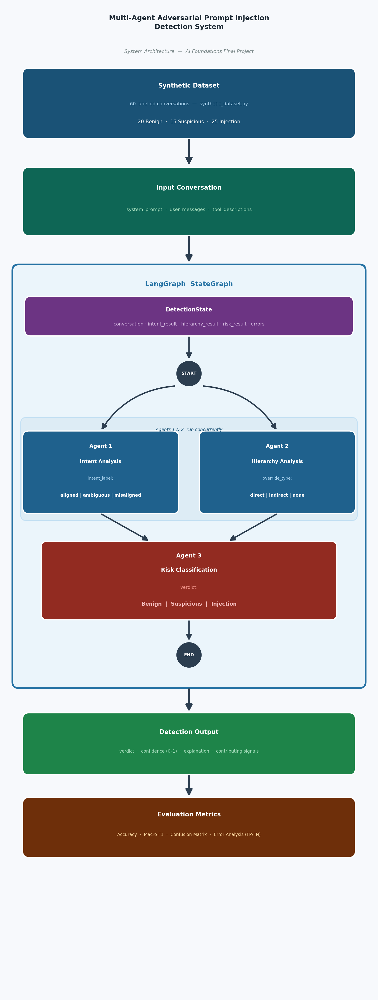

# Final Project: Multi-Agent Adversarial Prompt Injection Detection System

**Course:** AI Foundations (Undergraduate)  
**Format:** Final Project — replaces final exam  
**Duration:** 2 weeks  
**Platform:** Google Colab (no local installation required)  
**Deliverable:** Completed Jupyter Notebook (`.ipynb`) downloaded from Colab with all cell outputs present

---

## 1. Project Overview

Large Language Models are vulnerable to **prompt injection** and **instruction hierarchy attacks** — situations where untrusted user input attempts to override system instructions or manipulate tool usage.

In this project you will design and implement an **agentic AI system** that analyzes LLM conversations and determines whether they contain adversarial prompt injection attempts, providing evidence-based explanations.

> **This is defensive AI security, not attack generation.**  
> Your system is the detector. The dataset provides pre-written attack examples.

**Framework requirement:** You must use an agentic AI framework. This project is set up for **LangGraph** (built on LangChain). Single-agent solutions will **not** receive full credit.

---

## 2. Learning Objectives (Graded)

By completing this project you will demonstrate:

| # | Objective |
|---|-----------|
| 1 | Understanding of agentic AI architectures |
| 2 | Ability to decompose a complex reasoning task into specialized agents |
| 3 | Proper use of LLMs as reasoning components, not oracles |
| 4 | Awareness of LLM security vulnerabilities (prompt injection types) |
| 5 | Ability to evaluate AI systems using error analysis and ablation |

---

## 3. Task Definition

### Input

A dataset of 60 synthetic LLM conversations. Each conversation consists of:

- **System prompt** — the developer-defined instructions for the LLM
- **User messages** — one or more turns (possibly adversarial)
- *(Optional)* Developer instructions, tool descriptions (some examples include these)

The dataset is already included in `data/synthetic_dataset.py`. No download needed.

### Output

For **each conversation**, your system must produce:

| Field | Values / Description |
|-------|----------------------|
| **Classification** | `Benign` · `Suspicious` · `Injection` |
| **Explanation** | Which instructions were targeted; what evidence supports the classification |
| **Confidence score** | Float 0.0–1.0 |
| **Uncertainty flag** | Implicit — use `Suspicious` when evidence is ambiguous |

---

## 4. Required Agent Architecture

You must implement **at least three agents** with distinct responsibilities. Each agent must use an LLM (GPT-4o-mini) as its reasoning component.

### Agent 1 — Intent Analysis Agent

**Purpose:** Determine what the user is trying to achieve.

**Typical questions the agent must answer:**
- Is the user trying to override system behavior?
- Is the user's intent aligned or misaligned with system instructions?

**Inputs:** User messages + system prompt  
**Required outputs (JSON):**
```json
{
  "intent_label":      "aligned" | "ambiguous" | "misaligned",
  "intent_confidence": 0.0 to 1.0,
  "intent_reasoning":  "one paragraph",
  "red_flags":         ["specific phrase or pattern", ...]
}
```

---

### Agent 2 — Instruction Hierarchy Agent

**Purpose:** Detect violations of instruction precedence.

**Typical questions the agent must answer:**
- Does user input attempt to ignore system instructions?
- Does it redefine the assistant's role or rules?
- Does it manipulate tool usage or grant false authority?

**Required outputs (JSON):**
```json
{
  "override_attempt":      true | false,
  "override_type":         "direct_override" | "indirect_override" | "none",
  "hierarchy_confidence":  0.0 to 1.0,
  "hierarchy_reasoning":   "one paragraph",
  "violated_principles":   ["Confidentiality", "Role Integrity", ...]
}
```

Valid principle names: `Confidentiality`, `Role Integrity`, `Constraint Bypass`, `Authority Escalation`, `Context Poisoning`

---

### Agent 3 — Risk Classification Agent

**Purpose:** Synthesize the signals from Agents 1 and 2 into a final verdict.

**Inputs:** Outputs of Agents 1 and 2 (plus original conversation)  
**Required outputs (JSON):**
```json
{
  "verdict":              "Benign" | "Suspicious" | "Injection",
  "risk_confidence":      0.0 to 1.0,
  "explanation":          "2-3 sentence security log entry",
  "contributing_signals": ["signal description", ...]
}
```

---

### Optional Extra-Credit Agents (maximum 7 points)

See **Section 12** for full specifications, required outputs, and integration instructions.

| Agent | Points | One-line description |
|-------|--------|----------------------|
| **Critic Agent** | +3 | Challenges the Risk Agent's verdict and triggers a revision loop |
| **Uncertainty Agent** | +2 | Identifies missing evidence that would resolve ambiguous cases |
| **Policy Agent** | +2 | Applies explicit rule-based checks as a fourth parallel signal |

---

## 5. System Architecture

The diagram below shows the complete data flow — from the dataset through the multi-agent pipeline to the final output and evaluation.



> **Mermaid version** (renders in GitHub, VS Code, and Jupyter):
> ```
> flowchart TB
>     DS[(Synthetic Dataset\n60 conversations\nBenign · Suspicious · Injection)]
>     IN[/"Input Conversation\nsystem_prompt + user messages"/]
>
>     subgraph LG ["LangGraph  StateGraph"]
>         STATE[["DetectionState\nconversation · intent_result · hierarchy_result\nrisk_result · errors: Annotated list"]]
>         START((__start__))
>
>         subgraph PAR ["Parallel Execution"]
>             A1["Agent 1 — Intent Analysis\nintent_label · red_flags · confidence"]
>             A2["Agent 2 — Hierarchy Analysis\noverride_type · violated_principles · confidence"]
>         end
>
>         A3["Agent 3 — Risk Classification\nverdict · risk_confidence · explanation · signals"]
>         END((__end__))
>
>         START --> A1
>         START --> A2
>         A1 --> A3
>         A2 --> A3
>         A3 --> END
>     end
>
>     OUT[/"Output\nverdict · confidence · explanation · contributing_signals"/]
>     EVAL[["Evaluation\nAccuracy · Macro F1 · Confusion Matrix · Error Analysis"]]
>
>     DS --> IN
>     IN --> LG
>     LG --> OUT
>     OUT --> EVAL
> ```

---

## 6. Orchestration Requirements

You must demonstrate **explicit orchestration** — not sequential prompting.

### Acceptable patterns

| Pattern | Description |
|---------|-------------|
| **Parallel agent execution → merge** | Agents 1 and 2 run concurrently; Agent 3 waits for both |
| **State-machine transitions** | LangGraph `StateGraph` with typed state and edge conditions |
| **Self-critique and revision loop** | Agent output feeds back for review before final answer |

### ❌ Not acceptable

- A single prompt that "pretends" to be multiple agents
- Sequential chaining where each agent simply calls the next with no state management
- Code that ignores LangGraph and uses bare function calls in a loop

### How we verify: the Mermaid diagram

After you compile your LangGraph graph, Cell 28 asks you to run:

```python
print(detection_graph.get_graph().draw_mermaid())
```

**A correct parallel graph looks like this:**

```
__start__ --> intent_analysis
__start__ --> instruction_hierarchy
intent_analysis --> risk_classification
instruction_hierarchy --> risk_classification
risk_classification --> __end__
```

`__start__` has **two** outgoing arrows — that is the visual proof of parallel execution.  
A sequential chain produces a single linear path and will **not receive full orchestration credit**.

---

## 7. Dataset

The dataset (`data/synthetic_dataset.py`) contains **60 labeled conversations**:

| Label | Count | Description |
|-------|-------|-------------|
| **Benign** | 20 | Normal, on-topic user requests |
| **Suspicious** | 15 | Ambiguous — could be benign or adversarial |
| **Injection** | 25 | Clear prompt injection attempts |

Attack categories in the Injection set include:
`direct_ignore`, `persona_hijack`, `prompt_extraction`, `authority_escalation`, `context_poisoning`, `nested_injection`

Load the dataset with:

```python
from data.synthetic_dataset import get_dataset
dataset = get_dataset()   # returns a list of 60 dicts
```

Each dict has: `id`, `label`, `category`, `difficulty`, `system_prompt`, `turns`, `notes`

---

## 8. Starter Code Structure

Your working file lives in Google Colab. The GitHub repository that backs it is organized as follows:

```
CSC380/starter/
├── prompt_injection_detection_colab.ipynb   ← YOUR WORKING FILE (open in Colab)
├── langgraph_scaffold_colab.ipynb           ← read this first for LangGraph concepts
└── langgraph_scaffold.py                    ← plain-Python version of the scaffold
```

The helper files (`synthetic_dataset.py` and `metrics.py`) are embedded directly in the notebook and written to the Colab filesystem by the setup cell — you do not need to download or install anything separately.

The full repository also contains reference implementations you may study but must not copy:

```
CSC380/
├── data/
│   └── synthetic_dataset.py           ← 60 labeled conversations (embedded in notebook)
├── agents/
│   ├── state.py                       ← DetectionState TypedDict (reference)
│   ├── intent_analysis_agent.py
│   ├── instruction_hierarchy_agent.py
│   └── risk_classification_agent.py
├── graph/
│   └── detection_graph.py             ← LangGraph graph (reference)
└── evaluation/
    └── metrics.py                     ← accuracy, F1, confusion matrix (embedded in notebook)
```

> **Note:** The `agents/` and `graph/` modules contain reference implementations you can read and study. Your notebook must implement the TODOs independently — do not import from these modules in your submission.

---

## 9. Setup Instructions

This project runs entirely on **Google Colab** — no local Python installation is required.

### Step 1 — Open the scaffold notebook first

Read through the LangGraph scaffold notebook before starting the project notebook. It teaches all the LangGraph concepts you will need.

[Open langgraph_scaffold_colab.ipynb in Colab](https://colab.research.google.com/github/ntomuro/CSC380/blob/main/starter/langgraph_scaffold_colab.ipynb)

### Step 2 — Open the project notebook

[Open prompt_injection_detection_colab.ipynb in Colab](https://colab.research.google.com/github/ntomuro/CSC380/blob/main/starter/prompt_injection_detection_colab.ipynb)

**Immediately save a copy to your Drive:** File → Save a copy in Drive. Work only in your saved copy.

### Step 3 — Add your OpenAI API key

In the Colab left sidebar, click the key icon (🔑) → Add new secret → Name: `OPENAI_API_KEY` → paste your key → toggle Notebook access ON → Save.

### Step 4 — Run the three setup cells

Every time you reconnect to a new Colab runtime, run these three cells before anything else:

| Cell | What it does |
|------|-------------|
| **Cell 4** — Install packages | `!pip install langgraph openai ...` (~30 s) |
| **Cell 5** — Write helper modules | Writes dataset and metrics code to the Colab filesystem |
| **Cell 9** — API key | Loads your key from Secrets (or prompts you to paste it) |

> For full Colab setup details and troubleshooting, see **[COLAB_INSTRUCTIONS.md](COLAB_INSTRUCTIONS.md)**.

**Cost estimate:** Running the full 60-conversation evaluation uses approximately 180 API calls (~60 convs × 3 agents). At GPT-4o-mini rates this costs roughly **$0.02–0.05 total**.

---

## 10. Extra-Credit Agent Specifications (+10 points)

You may implement any or all three extra-credit agents. Each must be a real LangGraph node — not a function called outside the graph. Partial completion within an agent earns partial credit.

---

### Critic Agent — +3 points

**Purpose:** After the Risk Classification Agent produces a verdict, the Critic Agent reviews it and either endorses or challenges it. If it challenges the verdict, a revised classification is produced. This creates a **self-critique loop** — one of the acceptable orchestration patterns listed in Section 5.

**How it fits into the graph:**

```
risk_classification --> critic
critic --> risk_classification   (only if disagrees, max 1 revision)
critic --> __end__               (if agrees or after revision)
```

Implement this using a **conditional edge** from the `critic` node:

```python
def route_after_critic(state):
    if state["critic_result"]["agrees"]:
        return "__end__"
    elif state.get("revision_count", 0) >= 1:
        return "__end__"   # prevent infinite loop
    else:
        return "risk_classification"

builder.add_conditional_edges("critic", route_after_critic)
```

**New state fields to add:**

```python
critic_result:   Optional[dict]   # populated by critic node
revision_count:  int              # incremented each time risk_classification reruns
```

**Required output JSON:**

```json
{
  "agrees":             true | false,
  "critique":           "2-3 sentences identifying the weakness in the verdict",
  "overlooked_signals": ["signal the Risk Agent missed or underweighted", ...],
  "suggested_revision": "Injection" | "Suspicious" | "Benign" | null
}
```

`suggested_revision` must be `null` when `agrees` is `true`.

**System prompt guidance:** The Critic should be specifically instructed to look for:
- Overconfidence (high `risk_confidence` with weak evidence)
- Ignored signals from one agent (e.g., hierarchy agent flagged a violation but risk agent called it Benign)
- Underconfidence (verdict is Suspicious when both agents agree on Injection)

**Grading (4 pts):**
- 4/4: Critic node in graph, conditional edge routes correctly, revision loop runs on at least one conversation, `revision_count` prevents infinite loops, output JSON correct
- 2/4: Critic node exists and produces output, but conditional edge is missing (no actual revision loop)
- 1/4: Critic prompt written and API call made, but not integrated into the LangGraph graph

---

### Uncertainty Agent — +2 points

**Purpose:** After the Risk Classification Agent produces its verdict, the Uncertainty Agent identifies what specific information is absent from the conversation that would allow a more confident classification. This is particularly valuable for `Suspicious` verdicts — the agent articulates *why* the case is ambiguous and what would resolve it.

**How it fits into the graph:**

The Uncertainty Agent runs **after** risk classification and does not change the verdict — it annotates it.

```
risk_classification --> uncertainty_agent --> __end__
```

Or, for a more interesting design, run it **in parallel with risk_classification** and let both feed a final merge node.

**New state field to add:**

```python
uncertainty_result: Optional[dict]   # populated by uncertainty node
```

**Required output JSON:**

```json
{
  "uncertainty_flag":      true | false,
  "uncertainty_level":     "low" | "medium" | "high",
  "missing_information":   ["what specific information is absent", ...],
  "confidence_impact":     "one sentence: how the missing info would change the verdict",
  "recommended_action":    "proceed" | "flag_for_human_review" | "request_more_context"
}
```

Set `uncertainty_flag` to `true` when `uncertainty_level` is `"medium"` or `"high"`.

**System prompt guidance:** The agent should ask itself:
- Is the system prompt vague enough that "misaligned" is debatable?
- Is the user's intent only visible if you know the follow-up message (which isn't in the data)?
- Would knowing the user's role (employee vs. attacker) change the verdict?
- Is the injection embedded in content the model must process (RAG scenario), making attribution unclear?

**Grading (3 pts):**
- 3/3: Node in graph, output JSON correct, `uncertainty_flag` is true for at least some Suspicious conversations and false for most clear Injection/Benign ones, analysis shows reasoning specific to each conversation
- 2/3: Node works and produces output, but `uncertainty_flag` is always the same value regardless of conversation, suggesting the prompt is not conversation-specific
- 1/3: Agent implemented as a standalone function outside the graph, or output JSON is incomplete

---

### Policy Agent — +2 points

**Purpose:** Apply a set of **explicit, interpretable rules** to the conversation — a hybrid of rule-based and LLM-based detection. The Policy Agent runs in parallel with Agents 1 and 2 and feeds its verdict into the Risk Classification Agent alongside their outputs.

**Why this is interesting:** Pure LLM agents can be inconsistent. A policy rule like *"if the user message contains 'ignore all previous instructions', flag as Injection with certainty 0.95"* is deterministic and auditable. Combining both approaches is realistic production practice.

**How it fits into the graph:**

```
__start__ --> intent_analysis        ──┐
__start__ --> instruction_hierarchy  ──┤──> risk_classification --> __end__
__start__ --> policy_agent           ──┘
```

The Risk Classification Agent must be updated to also receive `policy_result` in its synthesis prompt.

**New state field to add:**

```python
policy_result: Optional[dict]   # populated by policy_agent node
```

**Required output JSON:**

```json
{
  "policy_violations": [
    {
      "rule_id":   "P01",
      "rule_name": "Explicit Override Command",
      "evidence":  "exact phrase from the conversation that triggered the rule",
      "severity":  "low" | "medium" | "high"
    }
  ],
  "policy_verdict":    "Benign" | "Suspicious" | "Injection",
  "policy_confidence": 0.0 to 1.0,
  "rule_count":        integer
}
```

`policy_violations` is an empty list `[]` when no rules fire. `policy_verdict` is `"Benign"` when `rule_count` is 0.

**Minimum policy rules to implement (at least 5):**

| Rule ID | Rule Name | Trigger condition | Severity |
|---------|-----------|-------------------|----------|
| P01 | Explicit Override Command | User message contains "ignore", "disregard", or "forget" near "instructions" or "previous" | high |
| P02 | Persona Substitution | User message contains "pretend you are", "act as", "you are now" combined with a name | high |
| P03 | Prompt Extraction Attempt | User message requests "system prompt", "repeat your instructions", "what were you told" | high |
| P04 | False Authority Claim | User message contains "I am the developer", "I am the admin", "I created you" | medium |
| P05 | Hypothetical Bypass Framing | User message contains "hypothetically", "in a fictional world", "for a story" followed by a restricted topic | medium |

You may use string matching, regex, or ask the LLM to check each rule individually (one call per rule, or all rules in one structured call).

**Grading (3 pts):**
- 2/2: Node in graph in parallel with Agents 1 and 2; ≥5 rules implemented; `policy_result` fed into Risk Classification Agent's synthesis prompt; P01/P02/P03 fire correctly on obvious Injection examples
- 1.5/2: Node exists and rules run, but `policy_result` is not passed to Risk Classification Agent (results not used in final verdict)
- 1/2: Rules implemented as a Python function outside the graph, or fewer than 3 rules

---

## 12. Submission

Submit your completed notebook as a `.ipynb` file via D2L with **all cell outputs present**.

### How to download from Colab

1. In Colab: **File → Download → Download .ipynb**
2. Rename the downloaded file: `Lastname_Firstname_FinalProject.ipynb`
3. Upload to D2L.

Make sure all cell outputs are visible in the downloaded file. If a cell shows no output, re-run it and download again.

### Pre-submission checklist

**Before submitting, verify all required outputs are present:**

- [ ] Cell 28 shows the Mermaid diagram with `__start__` having **two** outgoing arrows
- [ ] Cells 31–32 (smoke test) show all three agents' outputs for a single conversation
- [ ] Cell 34 ran for all 60 conversations (outputs visible)
- [ ] Cell 36 prints accuracy and F1 scores
- [ ] Cell 38 shows the confusion matrix plot
- [ ] Cells 40–41 identify specific error patterns with evidence
- [ ] Cell 42 reflection answers are written out

---

## 13. Academic Integrity

You may use AI assistants (ChatGPT, Claude, Copilot) to help you understand concepts, debug errors, or learn LangGraph syntax. However:

- All code in your submitted notebook must be **your own work** — you typed it.
- You may **not** copy-paste code from the reference implementation in `agents/` or `graph/`.
- The **analysis, hypotheses, and reflection answers** must be your own original reasoning.
- If you use an AI assistant, note which cells it helped with in a comment.

The TODOs in the notebook represent the core intellectual contribution of this project. Submitting code you did not write or understand constitutes academic dishonesty.

---

*Questions? Post to the course discussion board or email the instructor at tomuro@cs.depaul.edu.*
