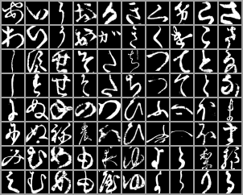

# :deciduous_tree: HW#3 Kuzushiji-46 Image Classification

## :deciduous_tree: Note

Assignment page: https://condor.depaul.edu/ntomuro/courses/380/2026spring/assign/HW2/hw2-2026spring.html

### :robot: Repository of the code files of the assignment.
<ul>
  <li>"Kuzushiji_starter.ipynb" -- Start-up Notebook filefor <b>Google Colab</b></li>
  <li>"Kuzushiji_starter.html" -- html version of the code above</li>
</ul>

## Kaggle Competition

Competition site: https://www.kaggle.com/t/c7c3009402644902b4f4240b38a0bd97

Submissions (on Kaggle) are accepted until May 19 (Tue) 10:00 pm (CDT).  Note the homework submissions (on D2L) are due the same day, May 19 (Tue) 11:59 pm (CDT).

## Acknowledgments

Maintained by Noriko Tomuro
